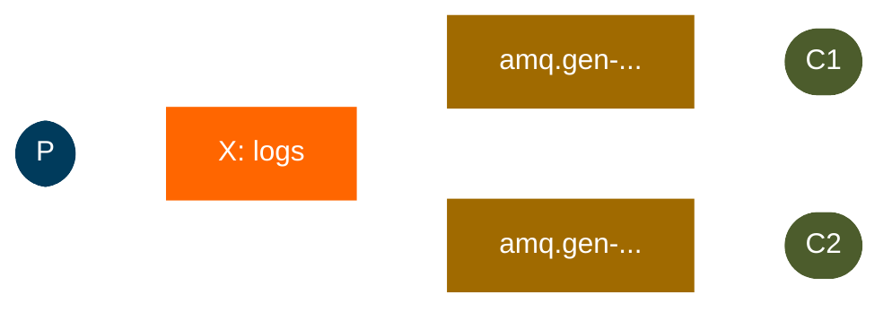

# Publish/Subscribe

In the [previous tutorial](work-queues.md) we created a work queue. The assumption behind a work queue is that each task
is delivered to exactly one worker. In this part we'll do something completely different -- we'll deliver a message to
multiple consumers. This pattern is known as "publish/subscribe".

To illustrate the pattern, we're going to build a simple logging system. It will consist of two programs -- the first
will emit log messages and the second will receive and print them.

In our logging system every running copy of the receiver program will get the messages. That way we can run one receiver
and direct the logs to disk; and at the same time we can run another receiver and see the logs on the screen.



Essentially, published log messages are going to be broadcast to all the receivers.

## Exchanges

In the previous parts of the tutorial we sent and received messages to and from a queue. Now it's time to introduce the
full messaging model in Rabbit.

The core idea in the messaging model in RabbitMQ is that **the producer never sends any messages directly to a queue**.
Actually, quite often the producer doesn't even know if a message will be delivered to any queue at all.

Instead, the producer can only send messages to an **exchange**. An exchange is a very simple thing. On one side it
receives messages from producers and the other side it pushes them to queues. The exchange must know exactly what to do
with a message it receives. The rules for that are defined by the **exchange type**.

There are a few exchange types available: `direct`, `topic`, `headers` and `fanout`. We're going to focus on the last
one -- the fanout. Let's create an exchange of this type, and call it `logs`:

```kotlin
channel.exchangeDeclare("logs", BuiltinExchangeType.FANOUT, durable = false, autoDelete = false, internal = false, arguments = emptyMap())
```

The fanout exchange is very simple. As you can probably guess from the name, it just broadcasts all the messages it
receives to all the queues it knows. And that's exactly what we need for our logger.

## Temporary queues

In the previous tutorials, we used queues with specific names (like `"hello"` and `"task_queue"`). Being able to name a
queue was crucial for us — we needed to point the workers to the same queue.

But for our logging system, we want to hear about all log messages, not just a subset of them. We're also interested
only in currently flowing messages, not in the old ones. To solve that we need two things:

1. Whenever we connect to Rabbit, we need a fresh, empty queue. We can create a queue with a random name, or even
   better - let the server choose a random queue name for us.
2. Once we disconnect the consumer, the queue should be automatically deleted.

In Kourier, we can create a temporary queue by supplying an empty string as the queue name. The server will generate a
unique name for us (typically something like `amq.gen-...`):

```kotlin
val queueDeclared = channel.queueDeclare(
    name = "",           // Empty = server generates name
    durable = false,
    exclusive = true,    // Deleted when connection closes
    autoDelete = true,   // Deleted when no consumers
    arguments = emptyMap()
)
val queueName = queueDeclared.queueName  // Get the generated name
```

## Bindings

We've already created a fanout exchange and a queue. Now we need to tell the exchange to send messages to our queue.
That relationship between an exchange and a queue is called a **binding**.

```kotlin
channel.queueBind(
    queue = queueName,
    exchange = "logs",
    routingKey = ""  // Ignored by fanout exchanges
)
```

From now on, the `logs` exchange will append messages to our queue.

## Sending

We'll publish messages to our `logs` exchange instead of the nameless one. We need to supply a `routingKey` when
sending, but its value is ignored for fanout exchanges:

```kotlin
suspend fun emitLog(coroutineScope: CoroutineScope, message: String) {
    val config = amqpConfig {
        server {
            host = "localhost"
        }
    }
    val connection = createAMQPConnection(coroutineScope, config)
    val channel = connection.openChannel()

    // Declare a fanout exchange - broadcasts to all bound queues
    channel.exchangeDeclare(
        "logs",
        BuiltinExchangeType.FANOUT,
        durable = false,
        autoDelete = false,
        internal = false,
        arguments = emptyMap()
    )

    // Publish to the exchange (routing key is ignored for fanout)
    channel.basicPublish(
        message.toByteArray(),
        exchange = "logs",
        routingKey = "",  // Routing key is ignored by fanout exchanges
        properties = Properties()
    )
    println(" [x] Sent '$message'")

    channel.close()
    connection.close()
}
```

**Key Points:**

- We publish to the `"logs"` exchange instead of directly to a queue
- We use `BuiltinExchangeType.FANOUT` for broadcasting
- The routing key is empty (ignored by fanout exchanges)
- We must declare the exchange before publishing to it

## Receiving

```kotlin
suspend fun receiveLogs(coroutineScope: CoroutineScope, subscriberName: String) {
    val config = amqpConfig {
        server {
            host = "localhost"
        }
    }
    val connection = createAMQPConnection(coroutineScope, config)
    val channel = connection.openChannel()

    // Declare the same fanout exchange
    channel.exchangeDeclare(
        "logs",
        BuiltinExchangeType.FANOUT,
        durable = false,
        autoDelete = false,
        internal = false,
        arguments = emptyMap()
    )

    // Declare a temporary, exclusive, auto-delete queue
    // The server generates a unique name for us
    val queueDeclared = channel.queueDeclare(
        name = "",           // Empty name = server generates a unique name
        durable = false,
        exclusive = true,    // Queue is deleted when connection closes
        autoDelete = true,   // Queue is deleted when no consumers
        arguments = emptyMap()
    )
    val queueName = queueDeclared.queueName
    println(" [$subscriberName] Created temporary queue: $queueName")

    // Bind the queue to the exchange
    channel.queueBind(
        queue = queueName,
        exchange = "logs",
        routingKey = ""  // Routing key is ignored for fanout
    )
    println(" [$subscriberName] Waiting for logs. To exit press CTRL+C")

    // Consume messages with auto-ack (since these are just logs)
    val consumer = channel.basicConsume(queueName, noAck = true)

    for (delivery in consumer) {
        val message = delivery.message.body.decodeToString()
        println(" [$subscriberName] $message")
    }

    channel.close()
    connection.close()
}
```

**Key Points:**

- We declare the same exchange as the producer
- We create a temporary queue with an empty name (server-generated)
- The queue is `exclusive` and `autoDelete` so it's automatically cleaned up
- We bind the queue to the exchange to receive messages
- We use `noAck = true` since these are transient log messages

## Putting it all together

Here's a complete example showing how to use the publisher and subscribers:

```kotlin
import dev.kourier.amqp.BuiltinExchangeType
import dev.kourier.amqp.Properties
import dev.kourier.amqp.connection.amqpConfig
import dev.kourier.amqp.connection.createAMQPConnection
import kotlinx.coroutines.*

fun main() = runBlocking {
    // Start multiple log receivers
    launch {
        receiveLogs(this, "Console-Logger")
    }
    launch {
        receiveLogs(this, "File-Logger")
    }
    launch {
        receiveLogs(this, "Database-Logger")
    }

    // Give receivers time to set up
    delay(1000)

    // Emit several log messages
    launch {
        emitLog(this, "info: Application started")
        delay(500)
        emitLog(this, "warning: High memory usage detected")
        delay(500)
        emitLog(this, "error: Database connection failed")
    }

    // Let receivers run
    delay(30000)
}
```

Move on to [tutorial 4](routing.md) to find out how to listen for a subset of messages.
