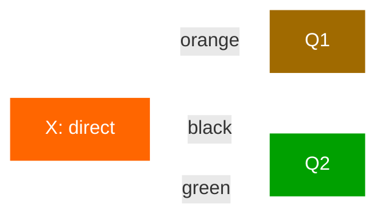
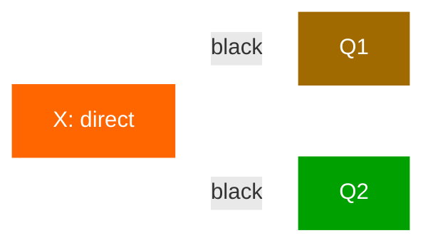

# Routing

In the [previous tutorial](publish-subscribe.md) we built a simple logging system. We were able to broadcast log
messages to many receivers.

In this tutorial we're going to add a feature to it — we're going to make it possible to subscribe only to a subset of
the messages. For example, we will be able to direct only critical error messages to the log file (to save disk space),
while still being able to print all of the log messages on the console.

## Bindings

In previous examples we were already creating bindings. You may recall code like:

```kotlin
channel.queueBind(queueName, exchangeName, routingKey = "")
```

A binding is a relationship between an exchange and a queue. This can be simply read as: the queue is interested in
messages from this exchange.

Bindings can take an extra `routingKey` parameter. To avoid the confusion with a `basicPublish` parameter we're going to
call it a `binding key`. This is how we could create a binding with a key:

```kotlin
channel.queueBind(queueName, exchangeName, routingKey = "black")
```

The meaning of a binding key depends on the exchange type. The fanout exchanges, which we used previously, simply
ignored its value.

## Direct exchange

Our logging system from the previous tutorial broadcasts all messages to all consumers. We want to extend that to allow
filtering messages based on their severity. For example, we may want the program which writes log messages to the disk
to only receive critical errors, and not waste disk space on warning or info log messages.

We were using a fanout exchange, which doesn't give us much flexibility - it's only capable of mindless broadcasting.

We will use a direct exchange instead. The routing algorithm behind a direct exchange is simple - **a message goes to
the queues whose binding key exactly matches the routing key of the message**.

To illustrate that, consider the following setup:



In this setup, we can see the direct exchange X with two queues bound to it. The first queue is bound with binding key
`orange`, and the second has two bindings, one with binding key `black` and the other one with `green`.

In such a setup a message published to the exchange with a routing key `orange` will be routed to queue Q1. Messages
with a routing key of `black` or `green` will go to Q2. All other messages will be discarded.

## Multiple bindings



It is perfectly legal to bind multiple queues with the same binding key. In our example we could add a binding between X
and Q1 with binding key `black`. In that case, the direct exchange will behave like fanout and will broadcast the
message to all the matching queues. A message with routing key `black` will be delivered to both Q1 and Q2.

## Emitting logs

We'll use this model for our logging system. Instead of fanout we'll send messages to a direct exchange. We will supply
the log severity as a routing key. That way the receiving program will be able to select the severity it wants to
receive. Let's focus on emitting logs first.

As always, we need to create an exchange first:

```kotlin
suspend fun emitLogDirect(coroutineScope: CoroutineScope, severity: String, message: String) {
    val config = amqpConfig {
        server {
            host = "localhost"
        }
    }
    val connection = createAMQPConnection(coroutineScope, config)
    val channel = connection.openChannel()

    // Declare a direct exchange
    channel.exchangeDeclare(
        "direct_logs",
        BuiltinExchangeType.DIRECT,
        durable = false,
        autoDelete = false,
        internal = false,
        arguments = emptyMap()
    )

    // Publish with severity as the routing key
    channel.basicPublish(
        message.toByteArray(),
        exchange = "direct_logs",
        routingKey = severity,  // Routing key determines message destination
        properties = Properties()
    )
    println(" [x] Sent '$severity':'$message'")

    channel.close()
    connection.close()
}
```

## Subscribing

Receiving messages will work just like in the previous tutorial, with one exception - we're going to create a new
binding for each severity we're interested in.

```kotlin
suspend fun receiveLogsDirect(
    coroutineScope: CoroutineScope,
    severities: List<String>
) {
    val config = amqpConfig {
        server {
            host = "localhost"
        }
    }
    val connection = createAMQPConnection(coroutineScope, config)
    val channel = connection.openChannel()

    // Declare the same direct exchange
    channel.exchangeDeclare(
        "direct_logs",
        BuiltinExchangeType.DIRECT,
        durable = false,
        autoDelete = false,
        internal = false,
        arguments = emptyMap()
    )

    // Declare a temporary queue
    val queueDeclared = channel.queueDeclare(
        name = "",
        durable = false,
        exclusive = true,
        autoDelete = true,
        arguments = emptyMap()
    )
    val queueName = queueDeclared.queueName

    // Bind the queue to the exchange for each severity
    for (severity in severities) {
        channel.queueBind(
            queue = queueName,
            exchange = "direct_logs",
            routingKey = severity
        )
    }
    println(" [*] Waiting for logs. To exit press CTRL+C")

    // Consume messages
    val consumer = channel.basicConsume(queueName, noAck = true)

    for (delivery in consumer) {
        val routingKey = delivery.message.routingKey
        val message = delivery.message.body.decodeToString()
        println(" [x] Received '$routingKey':'$message'")
    }

    channel.close()
    connection.close()
}
```

## Putting it all together

```kotlin
import dev.kourier.amqp.BuiltinExchangeType
import dev.kourier.amqp.Properties
import dev.kourier.amqp.connection.amqpConfig
import dev.kourier.amqp.connection.createAMQPConnection
import kotlinx.coroutines.*

fun main() = runBlocking {
    // Receive only errors (save to disk)
    launch {
        receiveLogsDirect(this, listOf("error"))
    }

    // Receive all logs (print to console)
    launch {
        receiveLogsDirect(this, listOf("info", "warning", "error"))
    }

    // Give subscribers time to set up
    delay(1000)

    // Emit log messages with different severities
    launch {
        emitLogDirect(this, "info", "Application started successfully")
        delay(500)
        emitLogDirect(this, "warning", "Memory usage at 80%")
        delay(500)
        emitLogDirect(this, "error", "Failed to connect to database")
    }

    delay(30000)
}
```

If you want to save only 'warning' and 'error' (and not 'info') log messages to a file, just open a console and type:

```kotlin
receiveLogsDirect(this, listOf("warning", "error"))
```

And if you want to see all log messages on your screen, open a new terminal and do:

```kotlin
receiveLogsDirect(this, listOf("info", "warning", "error"))
```

To emit an 'error' log message, just type:

```kotlin
emitLogDirect(this, "error", "Run. Run. Or it will explode.")
```

Move on to [tutorial 5](topics.md) to find out how to listen for messages based on a pattern.
