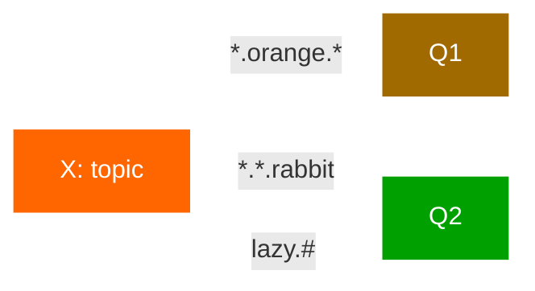

# Topics

In the [previous tutorial](routing.md) we improved our logging system. Instead of using a fanout exchange only capable
of dummy broadcasting, we used a direct one, and gained a possibility of selectively receiving the logs.

Although using the direct exchange improved our system, it still has limitations - it can't do routing based on multiple
criteria.

In our logging system we might want to subscribe to not only logs based on severity, but also based on the source which
emitted the log. You might know this concept from the [`syslog`](http://en.wikipedia.org/wiki/Syslog) unix tool, which
routes logs based on both severity (info/warn/crit...) and facility (auth/cron/kern...).

That would give us a lot of flexibility - we may want to listen to just critical errors coming from 'cron' but also all
logs from 'kern'.

To implement that in our logging system we need to learn about a more complex **topic** exchange.

## Topic exchange

Messages sent to a topic exchange can't have an arbitrary `routing_key` - it must be a list of words, delimited by dots.
The words can be anything, but usually they specify some features connected to the message. A few valid routing key
examples: `"stock.usd.nyse"`, `"nyse.vmw"`, `"quick.orange.rabbit"`. There can be as many words in the routing key as
you like, up to the limit of 255 bytes.

The binding key must also be in the same form. The logic behind the topic exchange is similar to a direct one - **a
message sent with a particular routing key will be delivered to all the queues that are bound with a matching binding
key**. However there are two important special cases for binding keys:

- `*` (star) can substitute for exactly one word.
- `#` (hash) can substitute for zero or more words.

It's easiest to explain this in an example:



In this example, we're going to send messages which all describe animals. The messages will be sent with a routing key
that consists of three words (two dots). The first word in the routing key will describe speed, second a colour and
third a species: `"<speed>.<colour>.<species>"`.

We created three bindings: Q1 is bound with binding key `"*.orange.*"` and Q2 with `"*.*.rabbit"` and `"lazy.#"`.

These bindings can be summarised as:

- Q1 is interested in all the orange animals.
- Q2 wants to hear everything about rabbits, and everything about lazy animals.

A message with a routing key set to `"quick.orange.rabbit"` will be delivered to both queues. Message
`"lazy.orange.elephant"` also will go to both of them. On the other hand `"quick.orange.fox"` will only go to the first
queue, and `"lazy.brown.fox"` only to the second. `"lazy.pink.rabbit"` will be delivered to the second queue only once,
even though it matches two bindings. `"quick.brown.fox"` doesn't match any binding so it will be discarded.

What happens if we break our contract and send a message with one or four words, like `"orange"` or
`"quick.orange.male.rabbit"`? Well, these messages won't match any bindings and will be lost.

On the other hand `"lazy.orange.male.rabbit"`, even though it has four words, will match the last binding and will be
delivered to the second queue.

**Topic exchange**

Topic exchange is powerful and can behave like other exchanges.

When a queue is bound with `"#"` (hash) binding key - it will receive all the messages, regardless of the routing key -
like in fanout exchange.

When special characters `"*"` (star) and `"#"` (hash) aren't used in bindings, the topic exchange will behave just like
a direct one.

## Putting it all together

We're going to use a topic exchange in our logging system. We'll start off with a working assumption that the routing
keys of logs will have two words: `"<facility>.<severity>"`.

The code is almost the same as in the [previous tutorial](routing.md).

```kotlin
suspend fun emitLogTopic(coroutineScope: CoroutineScope, routingKey: String, message: String) {
    val config = amqpConfig {
        server {
            host = "localhost"
        }
    }
    val connection = createAMQPConnection(coroutineScope, config)
    val channel = connection.openChannel()

    // Declare a topic exchange
    channel.exchangeDeclare(
        "topic_logs",
        BuiltinExchangeType.TOPIC,
        durable = false,
        autoDelete = false,
        internal = false,
        arguments = emptyMap()
    )

    // Publish with a routing key
    channel.basicPublish(
        message.toByteArray(),
        exchange = "topic_logs",
        routingKey = routingKey,
        properties = Properties()
    )
    println(" [x] Sent '$routingKey':'$message'")

    channel.close()
    connection.close()
}
```

The code for receiving messages:

```kotlin
suspend fun receiveLogsTopic(
    coroutineScope: CoroutineScope,
    bindingKeys: List<String>
) {
    val config = amqpConfig {
        server {
            host = "localhost"
        }
    }
    val connection = createAMQPConnection(coroutineScope, config)
    val channel = connection.openChannel()

    // Declare the same topic exchange
    channel.exchangeDeclare(
        "topic_logs",
        BuiltinExchangeType.TOPIC,
        durable = false,
        autoDelete = false,
        internal = false,
        arguments = emptyMap()
    )

    // Declare a temporary queue
    val queueDeclared = channel.queueDeclare(
        name = "",
        durable = false,
        exclusive = true,
        autoDelete = true,
        arguments = emptyMap()
    )
    val queueName = queueDeclared.queueName

    // Bind the queue with topic patterns
    for (bindingKey in bindingKeys) {
        channel.queueBind(
            queue = queueName,
            exchange = "topic_logs",
            routingKey = bindingKey
        )
    }
    println(" [*] Waiting for logs. To exit press CTRL+C")

    // Consume messages
    val consumer = channel.basicConsume(queueName, noAck = true)

    for (delivery in consumer) {
        val routingKey = delivery.message.routingKey
        val message = delivery.message.body.decodeToString()
        println(" [x] Received '$routingKey':'$message'")
    }

    channel.close()
    connection.close()
}
```

To receive all the logs:

```kotlin
receiveLogsTopic(this, listOf("#"))
```

To receive all logs from the facility `"kern"`:

```kotlin
receiveLogsTopic(this, listOf("kern.*"))
```

Or if you want to hear only about `"critical"` logs:

```kotlin
receiveLogsTopic(this, listOf("*.critical"))
```

You can create multiple bindings:

```kotlin
receiveLogsTopic(this, listOf("kern.*", "*.critical"))
```

And to emit a log with a routing key `"kern.critical"` type:

```kotlin
emitLogTopic(this, "kern.critical", "A critical kernel error")
```

Have fun playing with these programs. Note that the code doesn't make any assumption about the routing or binding keys,
you may want to play with more than two routing key parameters.

Move on to [tutorial 6](rpc.md) to learn how to implement a remote procedure call pattern as a round trip message.
