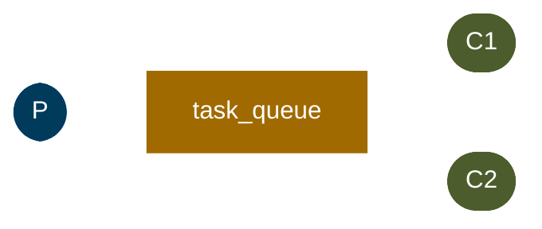

# Work Queues

In the [previous tutorial](hello-world.md), we wrote code to send and receive messages from a named queue. In this
tutorial, we'll create a Work Queue that will be used to distribute time-consuming tasks among multiple workers.

The main idea behind Work Queues (also known as Task Queues) is to avoid doing a resource-intensive task immediately
and having to wait for it to complete. Instead, we schedule the task to be done later. We encapsulate a task as a
message and send it to a queue. A worker process running in the background will pop the tasks and eventually execute
the job. When you run many workers, the tasks will be shared between them.

This concept is especially useful in web applications where it's impossible to handle a complex task during a short HTTP
request window.



## Round-robin dispatching

By default, RabbitMQ will send each message to the next consumer in sequence. On average, every consumer will get the
same number of messages. This way of distributing messages is called **round-robin**.

## Message acknowledgment

In order to make sure a message is never lost, RabbitMQ supports **message acknowledgments**. An acknowledgment is sent
back by the consumer to tell RabbitMQ that a particular message has been received, processed, and that RabbitMQ is free
to delete it.

If a consumer dies (its channel is closed, connection is closed, or TCP connection is lost) without sending an ack,
RabbitMQ will understand that a message wasn't processed fully and will re-queue it. This way you can be sure that no
message is lost, even if the workers occasionally crash.

Manual acknowledgments are turned on by default. In the previous tutorial, we explicitly turned them off using
`noAck = true`. It's time to set this flag to `false` and send proper acknowledgments from the worker.

## Message durability

We've learned how to make sure that even if the consumer dies, the task isn't lost. But our tasks will still be lost if
RabbitMQ server stops.

When RabbitMQ quits or crashes, it will forget the queues and messages unless you tell it not to. Two things are
required to make sure that messages aren't lost:

1. Mark the queue as **durable**
2. Mark messages as **persistent**

Note: Marking messages as persistent doesn't fully guarantee that a message won't be lost. Although it tells RabbitMQ to
save the message to disk, there is still a short time window when RabbitMQ has accepted a message and hasn't saved it
yet. For full persistence guarantees, you can use [publisher confirms](publisher-confirms.md).

## Fair dispatch

You might have noticed that the dispatching still doesn't work exactly as we want. For example, in a situation with two
workers, when all odd messages are heavy and even messages are light, one worker will be constantly busy and the other
one will do hardly any work.

RabbitMQ doesn't know anything about that and will still dispatch messages evenly. This happens because RabbitMQ just
dispatches a message when the message enters the queue. It doesn't look at the number of unacknowledged messages for a
consumer.

To defeat that, we can use the `basicQos` method with the `prefetchCount = 1` setting. This tells RabbitMQ not to give
more than one message to a worker at a time. In other words, don't dispatch a new message to a worker until it has
processed and acknowledged the previous one.

## Sending

Let's create a function that sends tasks to our work queue. We'll mark the queue as durable and messages as persistent:

```kotlin
suspend fun newTask(coroutineScope: CoroutineScope, message: String) {
    val config = amqpConfig {
        server {
            host = "localhost"
        }
    }
    val connection = createAMQPConnection(coroutineScope, config)
    val channel = connection.openChannel()

    // Declare a durable queue to survive broker restarts
    channel.queueDeclare(
        "task_queue",
        durable = true,        // Queue survives broker restart
        exclusive = false,
        autoDelete = false,
        arguments = emptyMap()
    )

    // Mark messages as persistent (deliveryMode = 2)
    val properties = properties {
        deliveryMode = 2u  // Persistent message
    }

    channel.basicPublish(
        message.toByteArray(),
        exchange = "",
        routingKey = "task_queue",
        properties = properties
    )
    println(" [x] Sent '$message'")

    channel.close()
    connection.close()
}
```

**Key Points:**

- `durable = true` makes the queue survive RabbitMQ restarts
- `deliveryMode = 2u` marks the message as persistent
- Together, these settings ensure tasks aren't lost even if RabbitMQ crashes

## Receiving

Now let's create our worker that will process tasks:

```kotlin
suspend fun worker(coroutineScope: CoroutineScope, workerName: String) {
    val config = amqpConfig {
        server {
            host = "localhost"
        }
    }
    val connection = createAMQPConnection(coroutineScope, config)
    val channel = connection.openChannel()

    // Declare the same durable queue
    channel.queueDeclare(
        "task_queue",
        durable = true,
        exclusive = false,
        autoDelete = false,
        arguments = emptyMap()
    )
    println(" [$workerName] Waiting for messages. To exit press CTRL+C")

    // Fair dispatch: don't give more than one message to a worker at a time
    channel.basicQos(count = 1u, global = false)

    // Consume with manual acknowledgment (noAck = false)
    val consumer = channel.basicConsume("task_queue", noAck = false)

    for (delivery in consumer) {
        val message = delivery.message.body.decodeToString()
        println(" [$workerName] Received '$message'")

        try {
            // Simulate work - each dot represents 1 second of work
            doWork(message)
            println(" [$workerName] Done")
        } finally {
            // Manual acknowledgment - message is removed from queue
            channel.basicAck(delivery.message, multiple = false)
        }
    }

    channel.close()
    connection.close()
}

/**
 * Simulates time-consuming work.
 * Each dot in the task string represents 1 second of work.
 */
private suspend fun doWork(task: String) {
    for (ch in task) {
        if (ch == '.') {
            delay(1000) // Sleep for 1 second per dot
        }
    }
}
```

**Key Points:**

- `noAck = false` enables manual acknowledgments
- `basicQos(count = 1u)` ensures fair dispatch - workers only get one unacked message
- `basicAck()` tells RabbitMQ the message is processed successfully
- Using `try`/`finally` ensures acknowledgment even if processing fails

## Putting it all together

Here's a complete example showing how to use the producer and consumer:

```kotlin
import dev.kourier.amqp.connection.amqpConfig
import dev.kourier.amqp.connection.createAMQPConnection
import dev.kourier.amqp.properties
import kotlinx.coroutines.*

fun main() = runBlocking {
    // Send several tasks
    launch {
        newTask(this, "First task.")
        newTask(this, "Second task..")
        newTask(this, "Third task...")
        newTask(this, "Fourth task.")
        newTask(this, "Fifth task..")
    }

    // Start multiple workers to process tasks
    launch {
        worker(this, "Worker-1")
    }
    launch {
        delay(100) // Small delay to ensure Worker-1 starts first
        worker(this, "Worker-2")
    }

    // Let workers run for a while
    delay(30000)
}
```

## Message Acknowledgment Patterns

### Forgotten Acknowledgments

It's a common mistake to miss `basicAck()`. It's an easy error, but the consequences are serious. Messages will be
redelivered when your client quits (which may look like random redelivery), but RabbitMQ will eat more and more memory
as it won't be able to release any unacked messages.

You can use RabbitMQ's management UI or `rabbitmqctl` to debug this issue:

```bash
rabbitmqctl list_queues name messages_ready messages_unacknowledged
```

### Acknowledgment from the Same Channel

Deliveries must be acknowledged on the same channel they were received. Attempting to acknowledge using a different
channel will result in a channel-level protocol exception.

Move on to [tutorial 3](publish-subscribe.md) to find out how to deliver the same message to many consumers.
